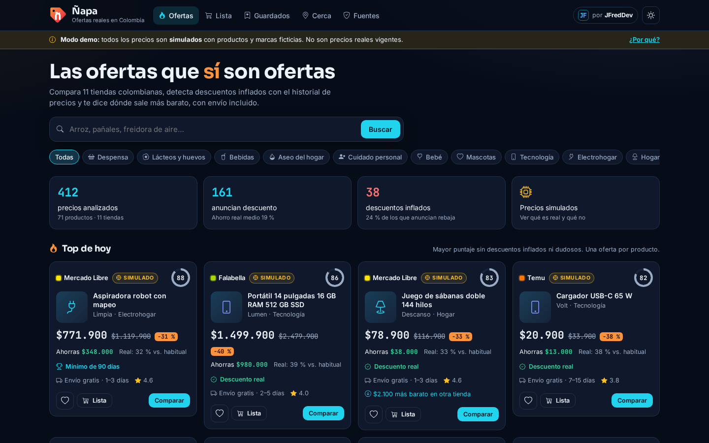
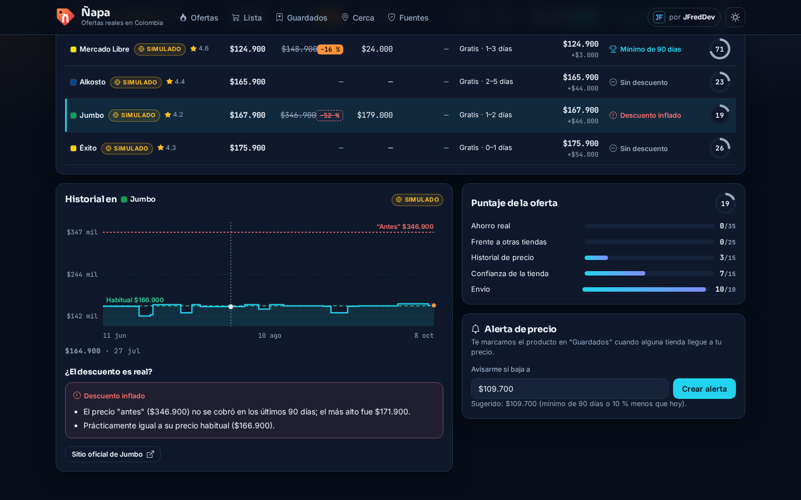
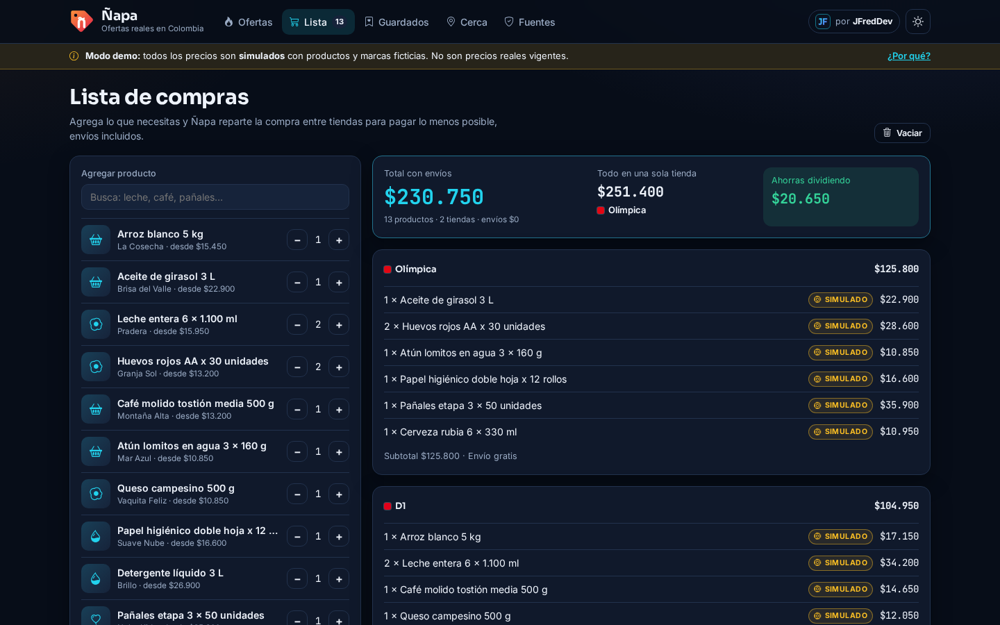
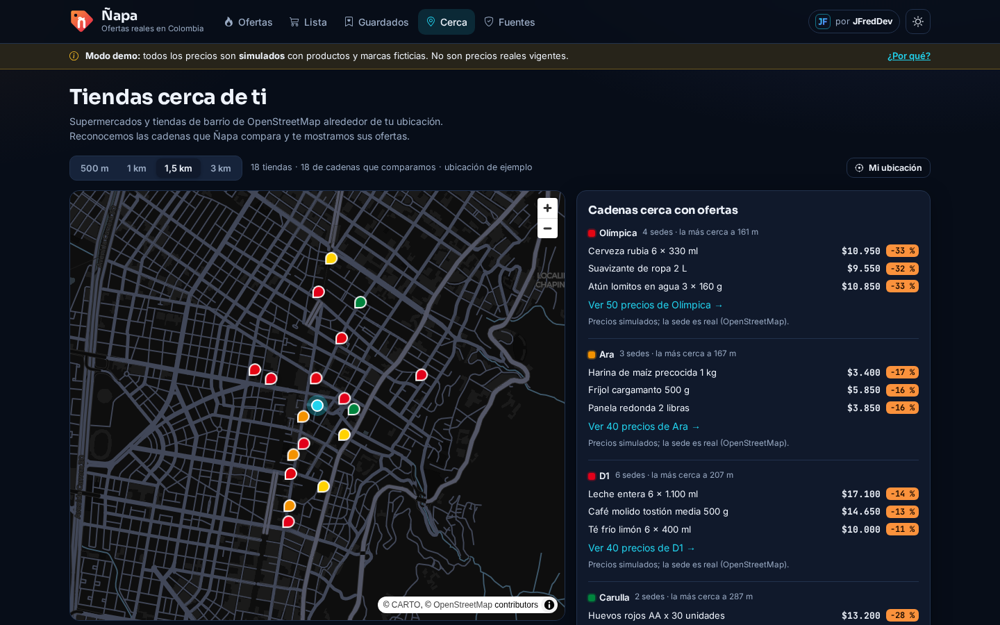
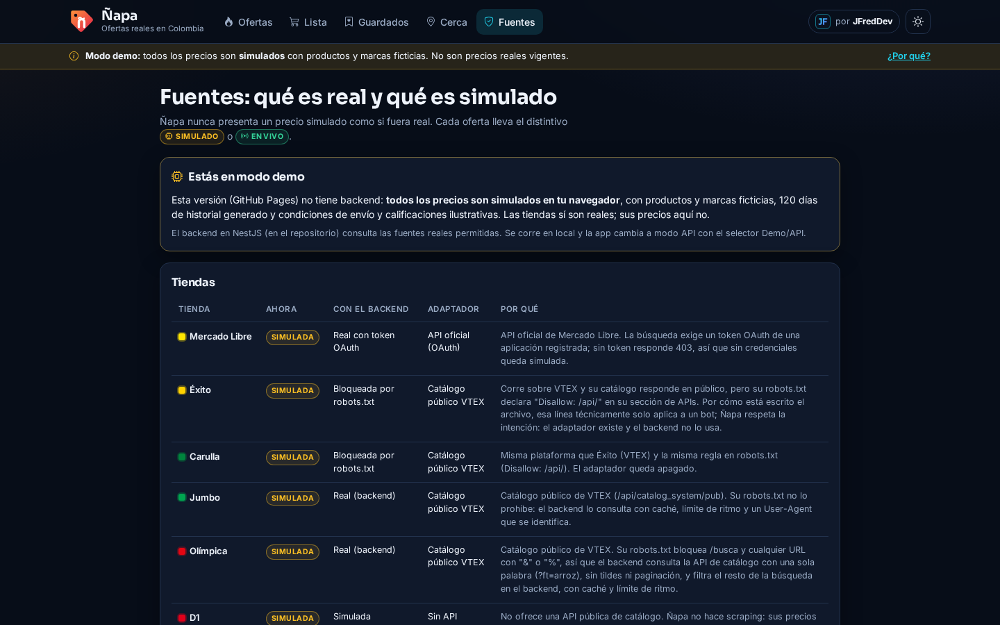
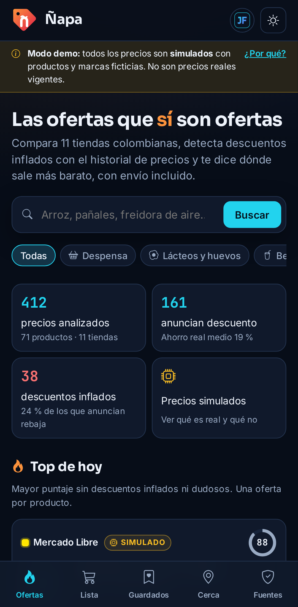
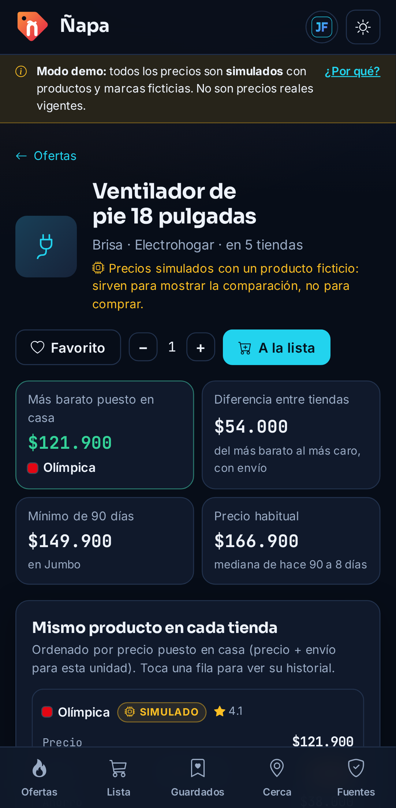
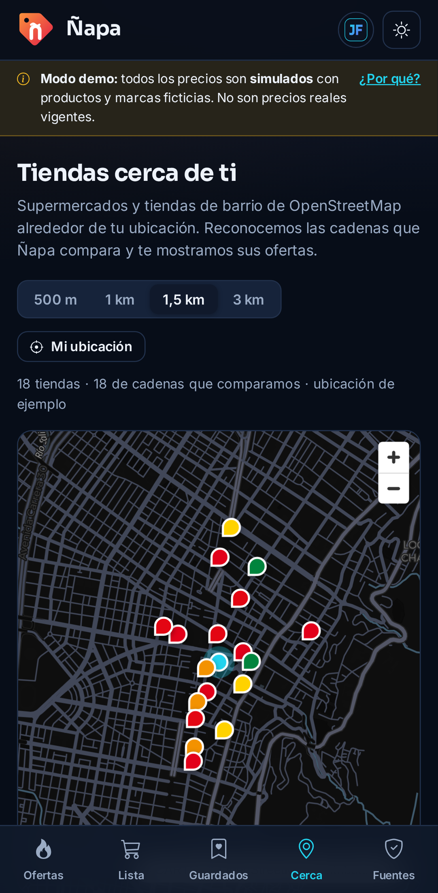
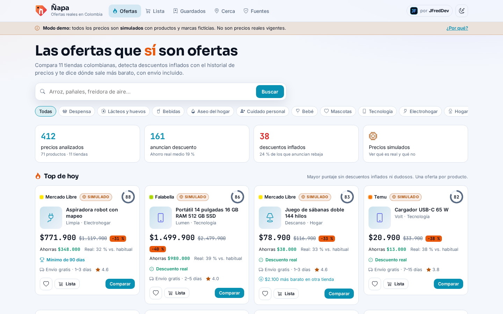

<p align="center">
  
</p>

<h1 align="center">Ñapa</h1>

<p align="center">
  <b>Las ofertas que sí son ofertas.</b><br />
  Buscador y recomendador de ofertas para Colombia: compara tiendas, detecta descuentos inflados con el historial
  de precios, calcula el precio por kilo o litro y reparte tu mercado entre tiendas para pagar menos.
</p>

<p align="center">
  <a href="https://jfredmc.github.io/napa/"><b>Ver la demo</b></a> ·
  <a href="#fuentes-qué-es-real-y-qué-es-simulado">Fuentes</a> ·
  <a href="#cómo-decide">Cómo decide</a> ·
  <a href="#servidor-en-render">Servidor</a> ·
  <a href="#desarrollo">Desarrollo</a>
</p>

<p align="center">
  <a href="https://github.com/JFredMC/napa/actions/workflows/ci.yml"></a>
  <a href="https://github.com/JFredMC/napa/actions/workflows/e2e-live.yml"></a>
</p>



> **Precios reales donde se permite, simulados y marcados donde no.** La app en GitHub Pages se conecta al
> servidor de Ñapa en Render (`https://napa-api.onrender.com`): Jumbo y Olímpica traen precios reales (`En vivo`).
> Si el servidor está dormido aparece **“Despertando el servidor…”** y mientras tanto se ve la demo; si no
> responde, se queda en la demo. En la demo los precios, productos y marcas son ficticios y así se marcan
> (`Simulado`). Ñapa no vende nada ni tiene relación con las tiendas.

## Qué hace

- **Puntaje de 0 a 100 por oferta**: ahorro real, precio frente a otras tiendas (con envío), historial, confianza de la tienda y envío.
- **Detector de descuentos inflados**: compara el precio “antes” con lo que de verdad se cobró en los últimos 90 días. Si el “antes” nunca se cobró, o el precio de hoy es el de siempre, la oferta se marca como inflada y su puntaje queda en máximo 30.
- **Historial de precios** de 120 días con el precio habitual y el “antes” anunciado sobre la gráfica.
- **Mismo producto en todas las tiendas**: precio, descuento, precio por unidad, envío, total puesto en casa y veredicto.
- **Precio por kilo, litro o unidad** que entiende presentaciones colombianas (`6 x 1.100 ml`, `x 160g x 4und`, `paca x 12`).
- **Top de hoy** y mejores ofertas por categoría, sin descuentos inflados ni dudosos.
- **Búsqueda y filtros** en la URL: tiendas, descuento mínimo, ocultar inflados, ordenar por puntaje, precio, descuento, ahorro o precio por unidad.
- **Lista de compras optimizada**: reparte la lista entre 1, 2 o 3 tiendas para pagar lo menos posible con envíos, y muestra cuánto falta para envío gratis.
- **Alertas de precio y favoritos** guardados en el navegador; las alertas cumplidas se marcan en la barra.
- **Tiendas cerca de ti** (solo si das permiso): sedes de OpenStreetMap vía Overpass, mapa MapLibre con estilos de CARTO (sin llaves) y las ofertas de cada cadena cercana.
- **Página de fuentes** que explica, tienda por tienda, qué es real, qué es simulado y por qué.
- Tema claro y oscuro, versión móvil con barra inferior, formato colombiano (`$4.300`, `12 %`).

| Descuento inflado                                                         | Lista de compras                                  |
| ------------------------------------------------------------------------- | ------------------------------------------------- |
|  |  |

| Tiendas cerca                                     | Fuentes                                               |
| ------------------------------------------------- | ----------------------------------------------------- |
|  |  |

| Móvil                                                         | Producto en móvil                                               | Cerca en móvil                                            | Tema claro                                                |
| ------------------------------------------------------------- | --------------------------------------------------------------- | --------------------------------------------------------- | --------------------------------------------------------- |
|  |  |  |  |

## Fuentes: qué es real y qué es simulado

Ñapa tiene un adaptador por tienda detrás de una interfaz común (`StoreConnector`). Solo hay adaptadores reales donde existe acceso público u oficial, y corren en el **servidor** (nunca en el navegador).

| Tienda                                   | Adaptador real                  | Hoy, con el servidor         | Por qué                                                                                                                                                                                                    |
| ---------------------------------------- | ------------------------------- | ---------------------------- | ---------------------------------------------------------------------------------------------------------------------------------------------------------------------------------------------------------- |
| Jumbo                                    | Catálogo público VTEX           | **En vivo**                  | Su robots.txt no prohíbe la API de catálogo.                                                                                                                                                               |
| Olímpica                                 | Catálogo público VTEX           | **En vivo**                  | Su robots.txt prohíbe URLs con `&` o `%`: se consulta `?ft=palabra` y se filtra en el servidor.                                                                                                            |
| Mercado Libre                            | API oficial (OAuth)             | En vivo **con credenciales** | Sin token de una app registrada responde 403. Ver [cómo crear la app](#mercado-libre-credenciales).                                                                                                        |
| Éxito, Carulla                           | Catálogo público VTEX (apagado) | Simulada                     | robots.txt prohíbe `/api/` y las búsquedas (solo quedaría rastrear el sitemap completo); su anti-bots responde `429 rate-limit-reason: bot` a un robot identificado; términos de uso personal (exito.com). |
| D1, Ara, Alkosto, Falabella, Shein, Temu | —                               | Simulada                     | Sin API pública de catálogo. **No se hace scraping.**                                                                                                                                                      |

Reglas del servidor: revisa `robots.txt` antes de cada dominio (y no consulta si no lo puede leer); solo consulta cuando alguien busca; como mucho una petición cada 2 s por tienda; caché de 1 hora; 60 peticiones por minuto por cliente; User-Agent que se identifica (`NapaBot/0.1 (+https://github.com/JFredMC/napa)`); no se disfraza de navegador, no resuelve captchas y no rota IPs. Si una fuente falla, esa tienda vuelve al simulado y la respuesta lo dice. Los precios reales solo se comparan con precios reales.

### Éxito y Carulla: por qué siguen simuladas

Revisado el 8 de octubre de 2026:

1. **robots.txt** (`User-agent: *`) prohíbe `/api/` (donde vive el catálogo VTEX), las búsquedas (`/s?`), los filtros y las colecciones. Lo único permitido serían las fichas de producto y los sitemaps que anuncia.
2. **Anti-bots**: esas páginas permitidas, incluido el sitemap que el propio robots.txt anuncia, responden `HTTP 429` con `rate-limit-reason: bot` a un robot que se identifica. Desde el servidor en Render (8 oct. 2026), Éxito siguió respondiendo 429 y el sitemap de Carulla sí respondió 200, así que en Carulla el bloqueo es intermitente. Pasar de ahí exigiría hacerse pasar por un navegador, y Ñapa no lo hace. El servidor guarda la última comprobación (como mucho una cada 12 h, a pedido) y la muestra en la página Fuentes.
3. **Sin búsqueda permitida**: aun cuando el sitemap responde, buscar un producto exigiría descargar el sitemap completo y leer ficha por ficha: un rastreo masivo, no una consulta a pedido.
4. **Términos y condiciones** de exito.com: el uso del sitio es “exclusivamente para su uso personal”.
5. No hay feed público de productos: **Referidos Éxito** es de cashback y la **API de Marketplace** de Éxito (Seller Center) solo da acceso a los productos del propio vendedor.

Para tenerlas en vivo haría falta **permiso escrito de Grupo Éxito** para el robot de Ñapa (o que lo pongan en su lista permitida), o un **convenio o feed de datos** con su área comercial o de e-commerce.

**Qué falta para más tiendas en vivo**

1. **Mercado Libre**: credenciales de una app (abajo).
2. **Éxito y Carulla**: permiso o convenio con Grupo Éxito. **D1, Ara, Alkosto, Falabella, Shein y Temu**: convenio, feed de afiliados o API oficial.
3. Una base de datos para el historial de precios reales: hoy vive en la memoria del servidor y se borra cuando el plan gratuito se duerme.

## Cómo decide

Todo vive en [`packages/deals-engine`](packages/deals-engine): TypeScript puro, sin dependencias y con pruebas.

| Concepto          | Regla                                                                                                                                 |
| ----------------- | ------------------------------------------------------------------------------------------------------------------------------------- |
| Precio habitual   | Mediana de los precios de hace 90 a 8 días (se necesitan al menos 21 días de historial)                                               |
| Descuento real    | `1 − hoy / habitual`; “mínimo de 90 días” si además es el precio más bajo del periodo                                                 |
| Descuento inflado | El “antes” anunciado nunca se cobró en 90 días (5 % de margen), o el precio de hoy no baja del habitual                               |
| Dudoso            | Anuncia 60 % o más y no hay historial para comprobarlo                                                                                |
| Puntaje           | Ahorro real 35 · frente a otras tiendas con envío 25 · historial 15 · confianza de la tienda 15 · envío 10; inflado ≤ 30, dudoso ≤ 50 |
| Precio por unidad | Lee el tamaño del título (`kg`, `g`, `L`, `ml`, `und`, multipacks) y lo lleva a kilo, litro o unidad                                  |
| Mismo producto    | Agrupa por marca, tamaño y palabras del título entre tiendas                                                                          |
| Lista de compras  | Prueba las combinaciones de hasta 3 tiendas (más búsqueda local) con envío por tienda y envío gratis desde cierto monto               |

Los datos simulados son deterministas por día: mismas marcas ficticias, 120 días de historial y cuatro escenarios por oferta (promoción real, “antes” inflado que nunca se cobró, subida antes de la rebaja o precio normal).

## Servidor en Render

`apps/api` (NestJS 11) corre en el plan gratuito de Render con el Blueprint [`render.yaml`](render.yaml): servicio `napa-api`, rama `main`, instala desde la raíz del monorepo y construye solo la API. Se despliega solo cuando el CI de `main` pasa.

[](https://render.com/deploy?repo=https://github.com/JFredMC/napa)

| Ajuste       | Valor                                                                                                                                                                                  |
| ------------ | -------------------------------------------------------------------------------------------------------------------------------------------------------------------------------------- |
| Build        | `pnpm install --frozen-lockfile --prod=false --filter @napa/api... && pnpm --filter @napa/deals-engine build && pnpm --filter @napa/connectors build && pnpm --filter @napa/api build` |
| Start        | `node apps/api/dist/main.js`                                                                                                                                                           |
| Health check | `/api/health`                                                                                                                                                                          |
| Variables    | `NODE_VERSION=22`, `CORS_ORIGINS=https://jfredmc.github.io`, `LIVE_STORES=jumbo,olimpica,exito,carulla`, `CACHE_TTL_MS=3600000`, `UPSTREAM_INTERVAL_MS=2000`, `CLIENT_RPM=60`          |
| Secretos     | `ML_CLIENT_ID`, `ML_CLIENT_SECRET`, `ML_REFRESH_TOKEN` (opcionales; se ponen en el panel de Render, nunca en el repositorio)                                                           |

Endpoints: `GET /api/search?q=arroz&category=despensa&stores=jumbo,olimpica&limit=24`, `GET /api/sources` y `GET /api/health`.

**Arranque en frío.** El plan gratuito se duerme tras 15 minutos sin uso y tarda hasta un minuto en despertar. La web pregunta a `/api/health`: si responde, usa el modo API; si tarda más de 1,5 s muestra “Despertando el servidor…” con la demo mientras tanto; si en 75 s no responde, se queda en la demo y ofrece reintentar. El selector Demo/API recuerda la elección.

### Mercado Libre: credenciales

1. Entrar a [developers.mercadolibre.com.co](https://developers.mercadolibre.com.co/) con la cuenta de Mercado Libre Colombia y abrir **Mis aplicaciones → Crear aplicación**.
2. Nombre `Ñapa`, nombre corto `napa`, descripción breve, URL de redirección `https://jfredmc.github.io/napa/` (no se usa más que para recibir el código), permisos de **lectura** y **acceso offline** (para recibir refresh token); sin notificaciones.
3. Copiar el **App ID** (`ML_CLIENT_ID`) y la **Secret Key** (`ML_CLIENT_SECRET`).
4. Autorizar la app abriendo `https://auth.mercadolibre.com.co/authorization?response_type=code&client_id=APP_ID&redirect_uri=https://jfredmc.github.io/napa/` y copiar el `code=` de la URL a la que vuelve.
5. Cambiar el código por tokens (vence en minutos):
   `curl -X POST https://api.mercadolibre.com/oauth/token -d grant_type=authorization_code -d client_id=APP_ID -d client_secret=SECRET -d code=CODE -d redirect_uri=https://jfredmc.github.io/napa/`
   y guardar el `refresh_token` de la respuesta (`ML_REFRESH_TOKEN`).
6. Poner los tres valores como variables secretas del servicio `napa-api` en Render. El refresh token es de un solo uso y el servidor lo renueva en memoria; si el servicio se reinicia mucho tiempo después, puede hacer falta repetir los pasos 4 y 5.

## Monetización (todo por configuración)

Nada de esto trae IDs en el código: sin variables, todo queda apagado y los enlaces van directo a la tienda.

- **Enlaces de afiliado** por tienda (`packages/connectors/src/links.ts`). Cada regla es una plantilla de deeplink con `{url}` (Admitad, Awin o el generador de la tienda) o parámetros `clave=valor` que se agregan a la URL. Las ofertas en vivo enlazan a la ficha real; las simuladas, a la búsqueda pública de la tienda (nunca a una ficha inventada).
- **Botones de salida** “Ir a la tienda”, “Ver en Éxito” y “Ver en Carulla” (abren su buscador; Ñapa no consulta esas páginas): pestaña nueva, `rel="sponsored nofollow noopener"` y nota cuando el enlace es de afiliado. Aviso de afiliados al pie y en [`/afiliados`](https://jfredmc.github.io/napa/afiliados).
- **Conteo de clics sin datos personales**: `POST /api/click?store=&kind=&aff=` (beacon) suma contadores por día; `GET /api/clicks` con `Authorization: Bearer ADMIN_TOKEN`. Sin IP, User-Agent ni cookies; en memoria.
- **Anuncios**: espacios reservados de AdSense (portada y producto) que no existen hasta tener ID de editor, ID de bloque y consentimiento. `ads.txt` se genera con el build.
- **Consentimiento** (Ley 1581 y Google): nada de terceros carga antes de decidir; “Solo necesarias”, “Configurar” (estadísticas, anuncios, anuncios personalizados) o “Aceptar todo”; si no se aceptan los personalizados, AdSense pide no personalizados. Retirar un permiso recarga la página.
- **Analítica sin cookies**: GoatCounter o Cloudflare Web Analytics, solo con consentimiento.
- **Páginas legales**: [privacidad](https://jfredmc.github.io/napa/privacidad) (Ley 1581/2012), [términos](https://jfredmc.github.io/napa/terminos), [afiliados y publicidad](https://jfredmc.github.io/napa/afiliados) y [cookies](https://jfredmc.github.io/napa/cookies).

Variables del repositorio (Settings → Secrets and variables → Actions → Variables), leídas por `pages.yml`:

| Variable                                              | Ejemplo                                    | Para qué                                        |
| ----------------------------------------------------- | ------------------------------------------ | ----------------------------------------------- |
| `NAPA_SITE_URL`                                       | `https://napa.co/`                         | Dominio propio: base href, CNAME, sitemap, OG   |
| `NAPA_API_URL`                                        | `https://napa-api.onrender.com`            | Backend (si cambia)                             |
| `NAPA_AFF_<TIENDA>`                                   | `https://ad.admitad.com/g/XXXX/?ulp={url}` | Regla de afiliado por tienda (`SHEIN`, `TEMU`…) |
| `NAPA_ADSENSE_CLIENT`                                 | `ca-pub-0000000000000000`                  | ID de editor de AdSense                         |
| `NAPA_ADSENSE_SLOT_FEED`, `NAPA_ADSENSE_SLOT_PRODUCT` | `1234567890`                               | IDs de los bloques de anuncios                  |
| `NAPA_GOATCOUNTER` o `NAPA_CF_BEACON_TOKEN`           | `napa`                                     | Analítica sin cookies                           |
| `NAPA_CONTACT_EMAIL`, `NAPA_LEGAL_OWNER`              | `datos@napa.co`                            | Responsable y contacto en la política de datos  |
| `NAPA_TELEGRAM_URL`, `NAPA_WHATSAPP_URL`              | `https://t.me/napaofertas`                 | Enlaces a los canales en el pie                 |

En Render (backend): `ADMIN_TOKEN` (mín. 24 caracteres) y las mismas `NAPA_AFF_<TIENDA>` para los enlaces del canal.

## Arquitectura

```
napa/
├── packages/deals-engine   Motor: precio por unidad, historial, descuentos, puntaje, ranking, lista, alertas, geo
├── packages/connectors     Interfaz StoreConnector, un adaptador por tienda (VTEX, Mercado Libre, simulados)
├── apps/api                NestJS 11 en Render: proxy CORS, robots.txt, caché, límite de ritmo, historial en memoria
└── apps/web                Angular 22: standalone, signals, zoneless, OnPush
    ├── core/               Catálogo (demo o API), listas, ubicación, tema, formato
    ├── shared/             Tarjeta de oferta, gráfica SVG propia, distintivos
    └── features/           ofertas · producto · lista · guardados · cerca · fuentes
```

- Web en GitHub Pages (`base href` `/napa/` y `404.html` para las rutas) con modo API (servidor en Render) y demo de respaldo. MapLibre se carga solo en “Cerca”.
- La ubicación solo se pide al tocar el botón, se usa una vez para consultar Overpass y no se guarda.
- Favoritos, alertas y lista quedan en `localStorage`.

## Desarrollo

Requisitos: Node 22 y pnpm 10.

```bash
pnpm install
pnpm --filter @napa/deals-engine build && pnpm --filter @napa/connectors build
pnpm --filter @napa/web start                 # http://localhost:4200 (con el backend en :3000 aparece el selector Demo/API)

# Backend local (opcional)
cp apps/api/.env.example apps/api/.env        # credenciales de Mercado Libre si las tienes
pnpm --filter @napa/api build && pnpm --filter @napa/api start:prod

pnpm test        # motor y conectores (Vitest), API (Jest), app (Vitest con Angular)
pnpm --filter @napa/api test:e2e
pnpm lint
pnpm typecheck

# E2E con Playwright contra el build de Pages (escritorio y móvil)
pnpm --filter @napa/web build:pages
pnpm --filter @napa/web e2e
# …o contra el sitio en vivo
E2E_BASE_URL=https://jfredmc.github.io/napa/ pnpm --filter @napa/web e2e
```

CI corre formato, lint, typecheck, pruebas, build, la suite E2E de la API y la de la web en cada PR. Después de cada despliegue, la suite web se repite contra el sitio publicado. Las pruebas no tocan tiendas reales: la API usa un `fetch` falso y la web responde Overpass con sedes reales de OpenStreetMap y el servidor con respuestas reales capturadas, guardadas en `e2e/fixtures` (modo API, “despertando”, servidor caído y demo). Con la variable de repositorio `E2E_REAL_API=1`, la corrida en vivo además prueba el servidor real en Render.

## Licencia

MIT © Jhon Maquilon · [JFredDev](https://jfredmc.github.io/portfolio/)

Datos de sedes © colaboradores de [OpenStreetMap](https://www.openstreetmap.org/copyright) (ODbL). Mapas © [CARTO](https://carto.com/attributions). Los nombres de las tiendas son de sus dueños.
